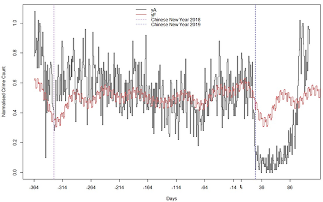

# Resilience of Criminogenic systems during COVID-19
## China

```
Crime:  Theft from commercial places
Period: 01/01/2020 - 29/04/2020 (120 days)
City:   Anonymous
```

## Results
A 64 per cent reduction in crime was found in the studied city (China) during an 83-day period, before daily crime levels bounced back to higher than expected values.



### Publications

Borrion, H., Kurland, J., Tilley, N., & Chen, P. (2020). Measuring the resilience of criminogenic ecosystems to global disruption: A case-study of COVID-19 in China. Plos one, 15(10) [Open Access](https://journals.plos.org/plosone/article?id=10.1371/journal.pone.0240077)


### Collaborators

Dr Justin Kurland,  Prof Nick Tilley, Dr Peng Chen


### Contact

h.borrion@ucl.ac.uk

